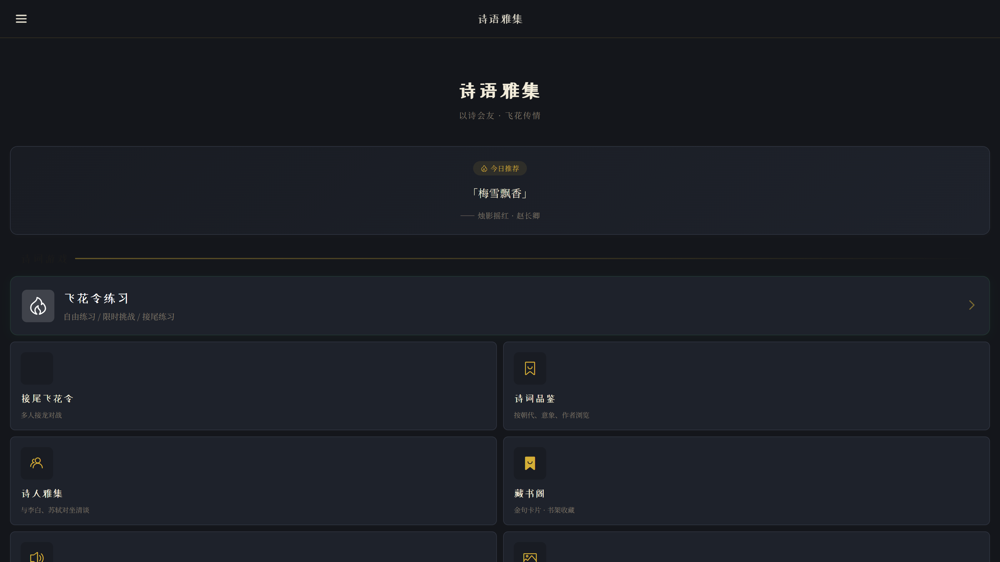
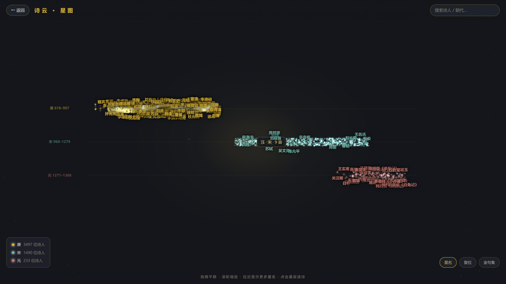
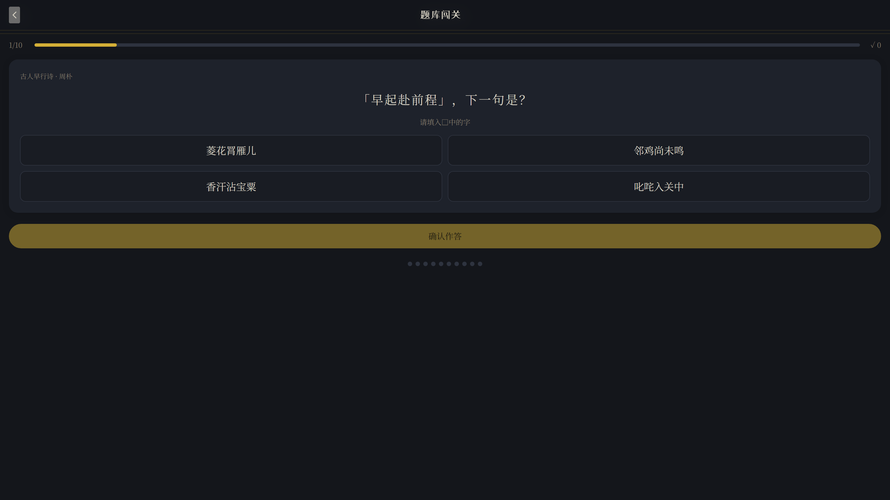
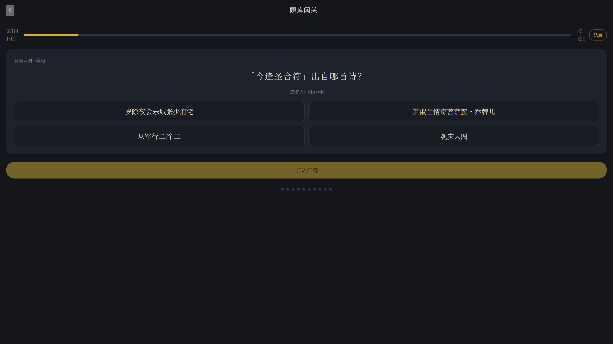

# 诗语雅集

> 让每一次社交，都有国风诗意。

一个基于二十四节气和飞花令的国风文化对战游戏。

## 产品定位

**诗语雅集** 是一个以飞花令对战为核心的文化体验产品，以节气五行主题增强当日玩法差异，让用户在娱乐中感受诗词魅力。

核心体验闭环：**对战 → 输赢 → 解锁诗句 → 文化延伸**

## 界面速览

| 首页 · 今日推荐 | 诗云 · 星图 |
| --- | --- |
|  |  |

| 题库闯关 | 无尽连刷 |
| --- | --- |
|  |  |

## 功能亮点

- 🎴 **飞花令对战**：2-8 人实时对战，文字输入、计时判题、淘汰结算
- 🌌 **诗云 · 星图**：5,200+ 位诗人按朝代铺成三条时间泳道（唐/宋/元），Three.js 3D 星体，点击诗人全屏品读原诗，金句一键摘录收藏
- 📖 **诗集品读**：按朝代/诗人浏览全库诗集，支持 AI 诗词解读
- 🏆 **题库闯关**：按朝代/诗人流派/主题意象/诗歌形式组题，答错有 AI 逐句讲解
- ♾️ **无尽连刷**：10 题一组无缝续组，实时累计正确率与连对，随时结算
- 🗓️ **节气主题**：今日推荐随二十四节气与节日智能变化

> 星图页面的创意与交互形式借鉴自 [iithink88/shiyun](https://github.com/iithink88/shiyun)（Three.js 诗词星系），在其基础上重构为朝代时间轴泳道、接入真实诗集数据库并扩展全屏品读与金句集，特此致谢。

## 一期范围

### 核心功能
- [x] 飞花令对战（2-8人，文字输入，计时，判题，淘汰，结算）
- [x] 节气主题（数据+展示）
- [x] 匿名身份 + 战绩（单设备）
- [x] 诗词收藏 + 节气收藏

### 技术栈
- 前端：Vue 3 + TypeScript + Vite + Vant UI
- 后端：Python Flask + Flask-SocketIO
- 数据库：SQLite
- 实时：Socket.IO

### 不做（一期）
- AI 成图
- 好友关系
- 支付/会员
- 复杂社交

## 快速开始

### 后端

```bash
cd backend
cp .env.example .env   # 按需填写配置
pip install -r requirements.txt
python app.py
```

服务启动在 http://localhost:5000

### 前端

```bash
cd frontend
npm install
npm run dev
```

访问 http://localhost:3000

> 后端默认代理到 `http://localhost:5000`；如后端用了其他端口，启动前端前设置 `BACKEND_PORT`（如 `BACKEND_PORT=5014 npm run dev`）。

### AI 功能（可选）

AI 诗词解读、诗人圆桌、题库 AI 讲解等功能基于 [DeepSeek](https://platform.deepseek.com)：

1. 申请一个 DeepSeek API Key
2. 写入 `backend/.env` 的 `DEEPSEEK_API_KEY`，或启动后在应用内「我的 → AI 设置」中填入
3. 所有 AI 功能的 Key 与开关统一在「AI 设置」管理（`backend/ai_hub.py` 为唯一接入层）

不配置 Key 不影响其他功能，AI 入口会显示引导提示。

## 项目结构

```
shiji/
├── backend/
│   ├── app.py              # Flask 主应用
│   ├── config.py           # 配置
│   ├── models.py           # 数据库模型
│   ├── data/
│   │   ├── solar_terms.py  # 24节气数据
│   │   └── poems.py        # 初始诗词数据
│   └── requirements.txt
├── frontend/
│   ├── src/
│   │   ├── pages/          # 页面组件
│   │   ├── stores/         # Pinia 状态
│   │   ├── api/            # API 客户端
│   │   └── socket.ts       # Socket.IO 客户端
│   ├── package.json
│   └── vite.config.ts
├── TASKS.md                # 任务清单
└── 诗语雅集_AI-Coding_PRD.md
```

## 数据来源

诗词数据来自 [chinese-poetry](https://github.com/chinese-poetry/chinese-poetry) 项目（MIT License）。

## 致谢

- [chinese-poetry](https://github.com/chinese-poetry/chinese-poetry) —— 诗词语料库
- [iithink88/shiyun](https://github.com/iithink88/shiyun) —— 诗云星图的创意来源
- [DeepSeek](https://platform.deepseek.com) —— AI 诗词解读与题库讲解

## License

MIT

## 补充截图

- 截图位于 `docs/screenshots/`，可用 `docs/capture.js`（playwright-core + Edge 无头）重新生成。

